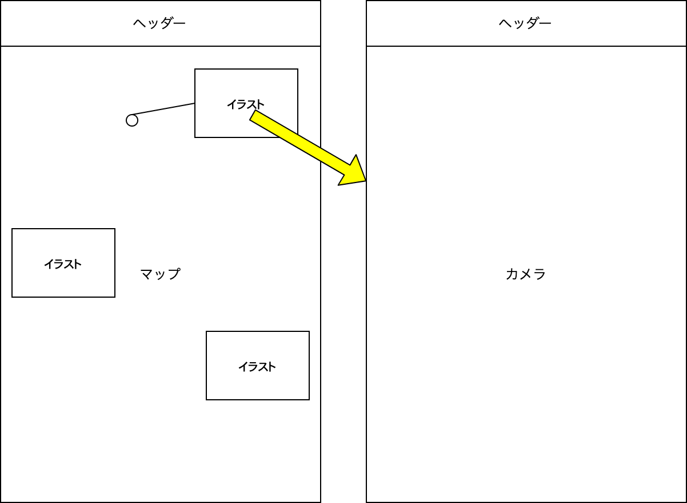

# 要件定義

要件をそれぞれ書く

**実装状況**
- [ ] level1
- [ ] level2
- [ ] level3

**ワイヤーフレーム&遷移図**

## level1(5/9~5/22)

### 実装機能
- マップ
    - 手書きマップを表示
    - スポットのイラストを表示
    - スポットを押したらカメラへ
    - 写真を撮ったらスポットがその写真に変わる
- カメラ
    - 撮れる

### knowledge

- 写真をローカルに保存する方法
  - https://qiita.com/takaking216/items/66c7799ef5cd222307d0
  - https://stackoverflow.com/questions/57737563/adding-dynamic-assets-to-flutter-app-in-runtime

## level2(5/23~6/26)

### 実装機能
- マップ
    - 自分の位置情報を取得
    - スポットの位置情報を取得
    - 近づいたらスポットを地図上に表示
    - ヒント
- カメラ
    - アプリ内で写真を保存できる
- 実機テスト
    - 自分の端末で動作確認
    - 現地での位置情報確認

## level3(6/27~7/10)

### 実装機能
- マップ
    - スポットをタップした時、近づいていなければ画像を大きく表示(モーダルウィンドウ)
- カメラ
    - 撮った写真をスマホ内に保存できる
- SNS共有
    - 撮影済みのスポットでタップした時のモーダルウィンドウの下部に共有ボタンを置く
