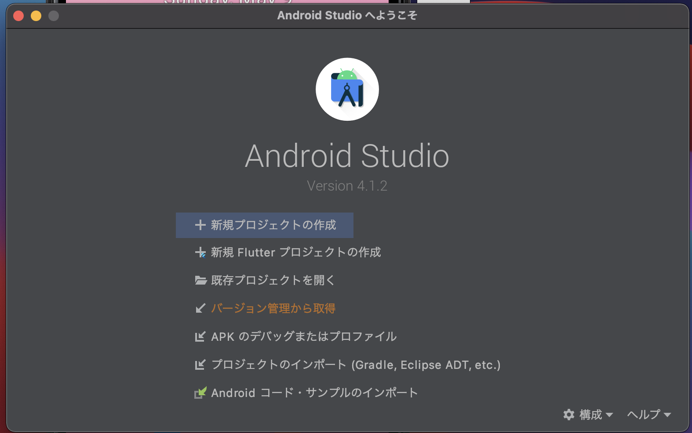
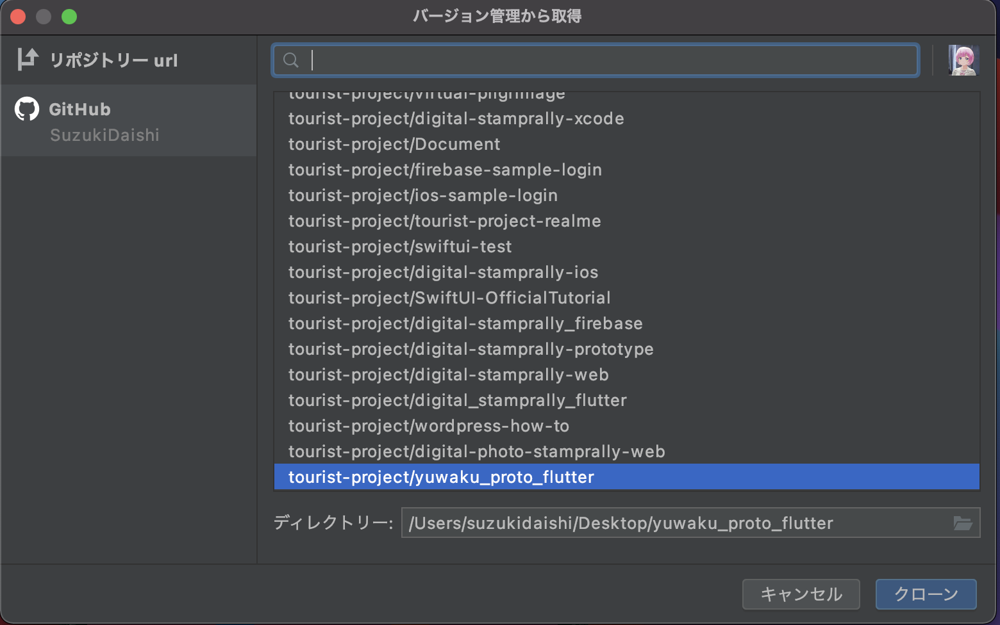
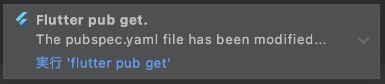

# yuwaku_proto_flutter

湯涌で用いるアプリ

## 使い方

まずAndroidStudioを開いて  
`バージョン管理の選択から取得`を押します  


`yuwaku_proto_flutter`を選択


起動すると下の方から`実行'flutter pub get'`と出てくるのでこれを押してください  
出てこない場合は`pubspec.yaml`に行き上の方に`flutter pub get`とあるのでそれを押してください  


## 環境
`flutter --version`は以下の通りです  
```
Flutter 2.0.6 • channel stable • https://github.com/flutter/flutter.git
Framework • revision 1d9032c7e1 (9 days ago) • 2021-04-29 17:37:58 -0700
Engine • revision 05e680e202
Tools • Dart 2.12.3
```

各地点の位置情報
湯涌稲荷神社: 経度 36.4856770, 緯度 136.7582343
総湯: 経度 36.48567221199191, 緯度 136.75751246063845
氷室:経度　36.48334703105948, 緯度　136.75708224329324
足湯(湯の出): 経度　36.48907313908926, 緯度 136.75600363400136
みどりの里: 経度 36.490402927190495, 緯度 136.75423519148546


## commitのルール

原則日本語体言止めで書く  
何をしたかが分かるように心がける  
伝わる範囲で短く書くように心がける
ガイドラインにとらわれ過ぎないように心がける  
絵文字を用いることでわかりやすく  
issueに紐付ける場合は`#n(nはissueの番号)`を書く  
  
例: :bug: コメントをお気に入りできないエラーを修正( #1 )
  
- :sparkles: `:sparkles:` - 新規追加  
- :pencil2: `:pencil2:` - 修正  
- :bug: `:bug:` - バグ修正  
- :fire: `:fire:` - 削除  
- :recycle: `:recycle:` - 整理
- :tada: `:tada:` - Initial Commitやリリースなど

## 要件定義
[こちら](./RDD.md)に書いてあります

## 参考文献
[emoji-commit-message-guideline](https://gist.github.com/p-chan/2912dc157b53449f7d1b)

## アプリイメージカラー
[R:240,G:233,B:208](https://color-hex.org/color/f0e9d0)  
[R:186,G:66,B:43](https://color-hex.org/color/ba422b)
